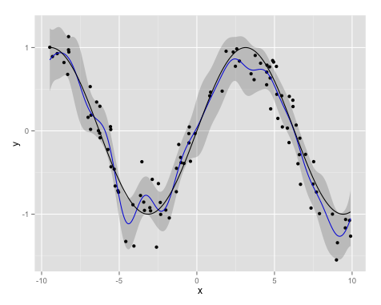

# gplib

The gplib library is a simplistic implementation of Guassian Process regression in R. It
can be used in a similar way to other models in R, for example

    library( gplib )
    
    gp( y ~ x1 + x2 + x3, data = data, kernel = make.kernel( "squared_exponential" ) )

And the return value supports some of the normal accessor functions like plot, predict
and print.

For example, the following code:

    x = -10 + 20 * runif( 100 )
    y = sin( 0.5*x ) + rnorm( 100, 0, 0.5 )
    original = data.frame( x = x, y = y )
    stats = gp( y ~ x )
    plot( stats, true_y = function(x) sin(0.5*x) )

Will produce a plot similar to the one below.

